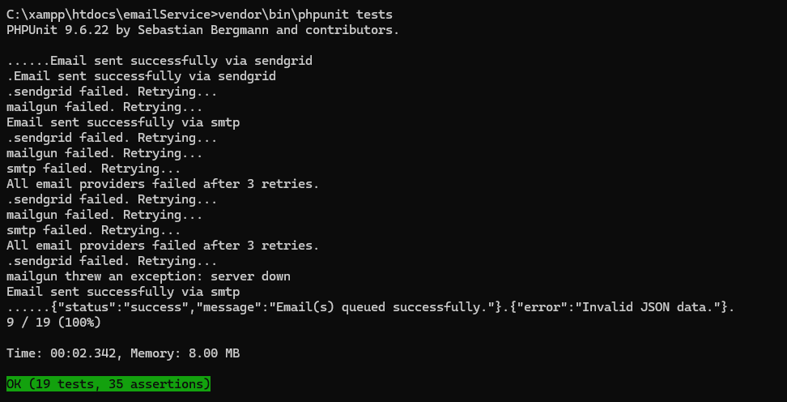
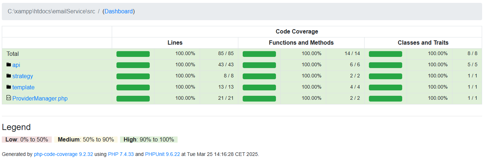

# Email Service API

An email service API designed to abstract multiple email service providers, support dynamic HTML templates with personalized data, and efficiently handle high volumes of concurrent emails.


## Features

- **Multiple Provider Support** 
- **Dynamic HTML Templates** 
- **High Concurrency Handling** 

## Requirements (Prerequisites)

Below tools and packages are required to successfully install this project.

- PHP version >=7.0.12
- Composer - PHP dependency manager [Install](https://getcomposer.org/doc/00-intro.md)
- Phpunit version ^9.0 [Install](https://phpunit.de/getting-started/phpunit-9.html)

## Installation

1. Clone the Repository:
```bash
git clone https://github.com/Rutasuvagiya/EmailService.git
```

2. Navigate to the Project Directory:
```bash
cd EmailService
```

3. Install Dependencies Using Composer:
```bash
composer install
```

4. Implementing asynchronous email sending in PHP on Windows using Redis involves setting up a queuing system where emails are queued for sending, and a background worker processes these queues to send the emails. Here's a step-by-step guide to achieve this:
```bash
    Install Redis on Windows

    Although Redis is primarily designed for Unix-based systems, you can run it on Windows using the following methods:

    Using Windows Subsystem for Linux (WSL): Install WSL and then install Redis within the Linux environment.

    Using Docker: Run a Redis container using Docker Desktop for Windows.

    For detailed instructions, refer to the official Redis installation guide for Windows.
```


## Usage

## Set Cron/Run file to send Emails

sendMailCron.php file must be run in background to send emails which are in queue. One cron sends around 750 emails per second.  
Run multiple crons in background if you want to send bulk mails for faster performance.
1. Run Command prompt  
2. Run Command
```bash
php <EmailService path>\src\sendMailCron.php
```

## API with json data

### Request

`POST sendEmail`

    curl -X POST -H "Content-Type: application/json" -d "{\"template_name\":\"welcome_email\",\"to\": \"test@nca.com\",\"data\":{\"name\":\"Test User\"}}" http://localhost/emailService/sendEmail.php

### Response
HTTP/1.1 200 OK
      {
        "status": "success",
        "message": "Email(s) queued successfully."
      }

## API with json data in file

### Request
```bash
`POST sendEmail`

    curl -X POST -F "json_file=@C:\tmp\emailQueue.json" http://localhost/emailService/sendEmail.php
```

### Json file format
```bash
    [{
     "to": "tracikinney@kozgene.com",
     "data": {
      "name": "Corine",
      "reset_link": "<a>Reset Password</a>"
     },
     "template_name": "subscription_email"
    },
    {
     "to": "corinekinney@joviold.com",
     "data": {
      "name": "Hollie"
     },
     "template_name": "welcome_email"
    }]
```

### Response
```bash
HTTP/1.1 200 OK
      {
        "status": "success",
        "message": "Email(s) queued successfully."
      }
```

## Add new Provider

To add a new email service provider:

Open \src\files\providerList.php file.  
Add provider name as a function with required content inside method in the following structure.

```bash
'sample1' => function ($to, $subject, $body) {
        //Logic of send mail
        echo "Trying Sample 1...";
        return rand(0, 1) === 1;
    }
```

## Add new Email Template

To add a new email template:

Open file \src\template\email_template.json file.  
Add new template with dynamic variables defined in {{variable}} with following structure

```bash
"subscription_email": {
        "subject": "Thank you for subscription, {{name}}",
        "body": "<p>Hi {{name}},</p><p>Thank you for subscribing to {{company}}! Please check your email for confirmation.</p>"
    }
```

## Running the unit tests



Below command is used to run the unit test:
```bash
$ vendor\bin\phpunit tests
```
To run unit test for a specific class/method:
```bash
$ vendor\bin\phpunit tests --filter "<test class name here>"
$ vendor\bin\phpunit tests --filter "<test method name here>"
```

## Generate code coverage report

Code coverage is a metric that can help you understand how much of your source is tested. It's a very useful metric that can help you assess the quality of your test suite.



To generate code coverage report
```bash
$ vendor\bin\phpunit --coverage-html coverage-report
```